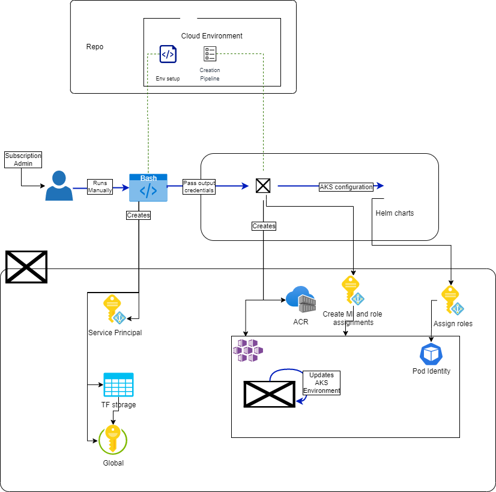

# Environment creation TD

## Introduction

Automation and operationalization of the environment is a core piece of the project. The following document illustrates the proposed architecture for Gen3 environment creation.The objective of the proposed scripts and CI/CD pipelines is to automate the integration and delivery of Gen3 microservices with minimal to no human intervention.

## Assumptions

- Based on customer requirements we are assuming the following technologies will be used:
  - [AKS](https://docs.microsoft.com/en-us/azure/aks/) will be the used to deploy the Kubernetes clusters
  - [Helm Charts](https://helm.sh/docs/topics/charts) – Abstraction for containerized application orchestration on Kubernetes.
  - [Flux](https://github.com/fluxcd/flux) – Used for GitOps flow that pulls changes from the environment repo and ensures the desired state in the git repository matches the one in Kubernetes.

## In Scope

- The Terraform setup required to deploy/destroy the environment
- The Azure DevOps pipelines required to run the Terraform scripts
- The auth required to performed all the required steps

## Out of Scope

- The application logic inside AKS cluster will be discussed in a different design

## Key Terms

- **Terraform**: Infrastructure as Code to provision and manage any cloud, infrastructure, or service
- **Azure DevOps**: A single platform that helps every software developer team on this planet design ventures utilizing the Agile process, oversee code utilizing Git, test the application, and deploy code using using the CI/CD framework.
- **AKS**: Highly available, secure, and fully managed Kubernetes service
- **KeyVault**: Safeguard cryptographic keys and other secrets used by cloud apps and services
- **Azure Storage**: a managed cloud storage service, that provides highly available, durable, scalable and redundant storage

## Open Questions

- What is the naming convention of the resources created?

#### Architecture and Sequence Diagrams

The Creation Pipeline will deploy the initial Gen3 environment in Azure. Resources created by this pipeline are referred to as “environment-level” resources. This pipeline is manually run by a user in the “subscription-admin” role. This role also should have sufficient permissions to role assignments to setup MSI. 

## Proposed Design

To achieve the environment creation explained above, we propose the following flow:

1. An Admin fetches the cloud environment repo and runs the `azure_admin.sh` to create the initial components (Storage account for TF, KeyVault and Service Principal used by Azure DevOps pipelines)
2. The purpose of KeyVault is to store the output of the initial script and it will contain the ServicePrincipal id, the storage account details and any other credentials/secrets that we may identify in the future
3. Once the script has finished, the admin will run the Creation Pipeline in Azure DevOps using the outputs from the script to pass the credentials of the KeyVault - this allows our pipeline to access the generated resources
4. The CreationPipeline will run a Terraform script that will deploy the rest of the infrastructure including AKS with MSI, ACR, 
6. As a final step, the Pipeline will update the AKS environment and activate pod identity with the correct role assignments.

The Terraform templates are an important element in the environment creation. To achieve best practices we investigated [Bedrock](https://github.com/microsoft/bedrock) and we propose the following bootstrap directory:

- The terraform state backend. resource group, storage container, storage blob will be handled by the initial bash script
- Aiming to not expose details and secrets about terraform backend in plain text. ex: tenant id, subscription id, secrets, etc.
- The AKS and ACR modules will be re-used from [Bedrock](https://github.com/microsoft/bedrock/tree/master/cluster/azure)
- src directory
  - `acr.tf` for resources related to container registry.
  - `aks.tf` for resources related to AKS.
    - Separate process outside of terraform to install pod identity.
  - `keyvault.tf` for resources related to kevault.
  - `db.tf` for resources related to cosmosdb.
  - `identity.tf` for role assignments.
  - `variables.tf` for input variables.
  - `outputs.tf` for output values that would be needed in other scripts and pipelines.

Terraform design decisions:

- Grouping resources in flat files and not creating custom modules.
- One file per major component of the infrastructure.
- Separate terraform state management vs infrastructure management.
- Separate creation of infrastructure vs configuration.

### Pros

- This approach minimizes the Admin intervention and only requires the initial bash script setup
- The terraform structure is simple. Someone can instantly get a high level understanding of the infrastructure by looking at the file names.
- Terraform state lifecycle can be managed separately from the rest of the infrastructure.

### Cons

- Running initial MSI creation during env setup will require naming input that propagate across the Azure DevOps pipeline
- Care has to be taken to keep the file structure inline with the high level infrastructure.

## Alternatives Considered

[Discuss the Gen3 CloudAutomation repo]

#### Pros
- The approach will follow best practices for Azure and will enable any admin to easily deploy the environment required to run Gen3 on Azure

#### Cons

- This repo is not integrated with the existing Gen3 community and will require education on how to setup on Azure
